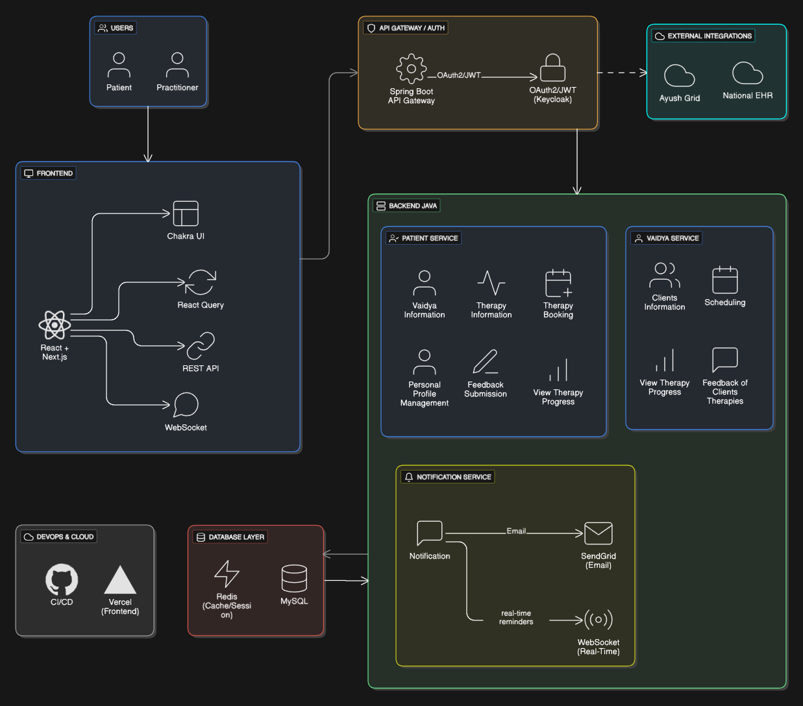
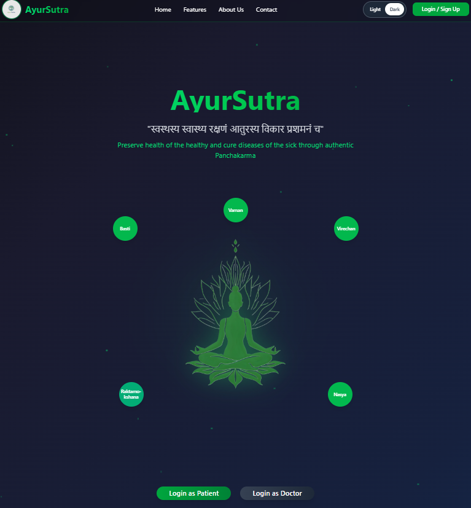

# AyurSutra – Smart Panchakarma Management System

### A Next-Generation Ayurvedic Care Platform

AyurSutra is a comprehensive web platform designed to streamline the **Panchakarma therapy management process** open for Ayurvedic practitioners and patients.  
It integrates **smart scheduling, treatment tracking, doctor verification, and unified medical record management** — delivering a seamless experience powered by modern full-stack technologies.

---

## 🧠 Key Highlights
- 🚀 **Top 8 Finalist** in *Smart India Hackathon (SIH) Internal 2025* out of 120 teams.
- 💡 Real-world application already sold to two doctors and actively in use, significantly improving their operational efficiency.
- 🔒 Backed by a secure architecture with **Spring Boot (backend)**, **React + Next.js (frontend)**, and **MySQL database**.

---

## 🏗️ System Architecture



### Overview
- Layered structure ensures modularity and maintainability:
  - **Controller Layer:** Handles HTTP requests/responses via REST APIs.  
  - **Service Layer:** Contains core business logic and validation.  
  - **DAO / Repository Layer:** Manages database operations through JPA/Hibernate.  
- **Database:** MySQL for relational data management.  
- **Security:** Spring Security + JWT authentication (extendable).  
- **Build Tool:** Maven.  
- **Frontend:** Responsive UI for patients and practitioners with seamless API integration using Axios/Fetch.  

---

## ⚙️ Core Features

-  **Smart Scheduling** – Auto-manages appointments for pre- and post-Panchakarma treatments.  
-  **Medication Tracking** – Keeps logs of medicines, dosages, and durations for each phase.  
-  **Feedback System** – Collects patient feedback at every stage to improve service quality.  
-  **Treatment Roadmap View** – Visual representation of the complete therapy lifecycle.  
-  **Doctor Verification via AyurGrid** – Ensures practitioner authenticity and transparency.  
-  **Centralized Medical Reports** – Stores prescriptions, test reports, and summaries securely.  
-  **Smart Notifications** – Sends timely updates and reminders through email.  
-  **Unified Health Summary PDF** – Generates a consolidated medical history document.

---





---

## 🧰 Tech Stack

| Category | Technologies |
|-----------|--------------|
| **Frontend** | React JS • Next.js • HTML5 • CSS3 • JavaScript (ES6+) |
| **Backend** | Java 17 • Spring Boot • Spring Data JPA • Hibernate |
| **Database** | MySQL |
| **Build Tools** | Maven • npm/yarn |
| **Version Control** | Git • GitHub |
| **Hosting/Deployment** | Vercel / Render / AWS (optional) |
| **Other Integrations** | AyurGrid API • Mail Notification Service • PDF Generator (iText / PDFBox) |

---

##  Run the Application

### 💻 Frontend (React + Next.js)
```bash
# Navigate to the frontend directory
cd AyurSutra

# Install dependencies
npm install

# Start the development server
npm run dev
```

```
AyurSutra/
│
├── Backend[Spring Boot]/
│   ├── src/main/java/com/ayursutra/controller/
│   ├── src/main/java/com/ayursutra/service/
│   ├── src/main/java/com/ayursutra/dao/
│   ├── src/main/resources/application.properties
│   └── pom.xml
│
├── AyurSutra[React + Next]/
│   ├── pages/
│   ├── components/
│   ├── public/
│   └── package.json
│
├── assets/
│   ├── architecture.png
│   └── screenshot.png
│
└── README.md
```
##  Contributors:

<p align="center">
  <a href="https://github.com/Darkegale12">
    
    <br />
    <sub><b>Vishwajeet More (Darkegale12)</b></sub>
  </a>
  &nbsp;&nbsp;&nbsp;
  <a href="https://github.com/Tanushka-Chavan">
    
    <br />
    <sub><b>Contributor 2</b></sub>
  </a>
</p>


##  Collaboration & Contact

For usage, contributions, or collaboration opportunities, feel free to reach out:  
📧 **vishwajeet12.messi@gmail.com**

## License
This project is licensed under the Eclipse Public License – v 2.0.
For more information,visit https://www.eclipse.org/legal/epl-2.0/
